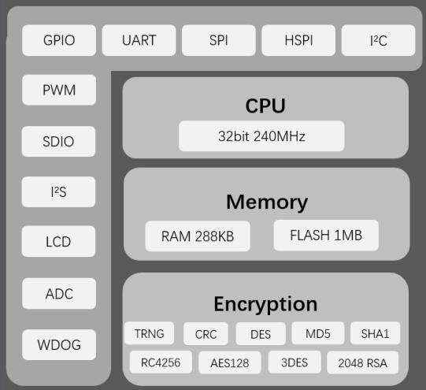

# [W806](https://github.com/SoCXin/W806)

* [winnermicro](http://www.winnermicro.com/): XT804
* [L5R4](https://github.com/SoCXin/Level): 240 MHz

## [简介](https://github.com/SoCXin/W806/wiki)

[W806](https://github.com/SoCXin/W806)内置 UART、GPIO、SPI、SDIO、I2C、I2S、PSRAM、7816、ADC、LCD、Touch Sensor 等数字接口；支持 TEE 安全引擎，支持多种硬件加解密算法，内置 DSP、浮点运算单元与安全引擎，支持代码安全权限设置，内置 1MB Flash 存储器，支持固件加密存储、固件签名、安全调试、安全升级等多项安全措施，保证产品安全特性。

### 关键特性

* 集成 32 位 XT804 处理器，工作频率 240MHz，内置 DSP、浮点运算单元与安全引擎
* 288KB RAM,1MB flash
* 集成 6 路 UART 高速接口
* 集成 4 路 16 比特 SD-ADC，最高采样率 1KHz
* 内置 Tee 安全引擎

#### 相对短板

* 平头哥CDK开发生态普及度

### [资源收录](https://github.com/SoCXin)

* [参考资源](src/)
* [参考文档](docs/)
* [参考工程](project/)
* [Xin文档](https://docs.soc.xin/W806)

### [选型建议](https://github.com/SoCXin)

[W806](https://github.com/SoCXin/W806)

#### 封装规格

* QFN56(6x6mm)

### [探索芯世界 www.SoC.xin](http://www.SoC.Xin)
